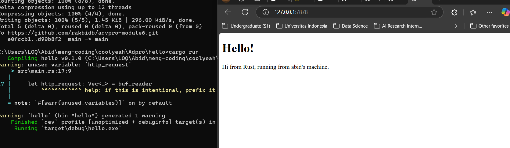
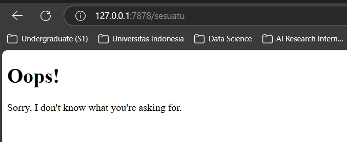

# Tutorial Module 6

```
Nama    : Rakha Abid Bangsawan
NPM     : 2206081585
Kelas   : B
```

1. Commit 1 - `handle_connection` Function

   ```
   fn handle_connection(mut stream: TcpStream) {
       let buf_reader = BufReader::new(&mut stream);
       let http_request: Vec<_> = buf_reader
           .lines()
           .map(|result| result.unwrap())
           .take_while(|line| !line.is_empty())
           .collect();

       println!("Request: {:#?}", http_request);
   }
   ```

   Berdasarkan informasi dari [dokumentasi Rust](https://doc.rust-lang.org/book/ch20-01-single-threaded.html), fungsi `handle_connection` berfungsi untuk menangani koneksi yang masuk ke server. Fungsi ini pertama-tama membuat instance `BufReader`, yang membungkus referensi *mutable* ke `stream`.

    Kemudian, variabel `http_request` digunakan untuk mengumpulkan baris-baris permintaan HTTP yang dikirimkan oleh browser ke server. Metode `lines()` dari `BufReader` menghasilkan iterator yang mengembalikan `Result<String, std::io::Error>`. Selanjutnya, baris-baris yang diterima dikumpulkan dalam sebuah vektor hingga ditemukan baris kosong, yang menandai akhir dari permintaan HTTP (karena browser mengakhiri permintaan dengan dua karakter *new line* berturut-turut).

    Dengan cara ini, fungsi `handle_connection` bertanggung jawab membaca dan memproses permintaan HTTP dari *stream* yang diterima oleh server.


2. Commit 2 - Returning HTML
    

    Beberapa tambahan kode terlihat setelah variabel `http_request`. Terdapat variabel `status_line` untuk status dari *request*. Lalu, program membaca file `hello.html` menggunakan `fs::read_to_string` dan menyimpannya ke variable `contents`. Ada juga variable `length` yang merepresentasikan panjang dari variabel `contents`. Selanjutnya, respon akan disimpan ke variabel `response`. `format!` akan digunakan untuk konten file sebagai *response body*. 

    `http_request` akan di-*ignore* sehingga semua *request* akan diterima dan akan mengembalikan *file* `hello.html`, artinya *request* `127.0.0.1:7878/sesuatu` juga akan mengembalikan respon yang sama.

3. Commit 3 - Validating Request and Selectively Responding
   
    
    Sebelumnya, semua *request* akan diterima dan program akan mengembalikan file `hello.html`. Oleh karena itu, pada *commit* ini saya memisahkan *response* tergantung *request*-nya.

    Pertama-tama, saya menambahkan block *if-else* untuk mengecek *request*:
    ```
    fn handle_connection(mut stream: TcpStream) {
    let buf_reader = BufReader::new(&mut stream);
    let request_line = buf_reader.lines().next().unwrap().unwrap();

    if request_line == "GET / HTTP/1.1" {
        let status_line = "HTTP/1.1 200 OK";
        let contents = fs::read_to_string("hello.html").unwrap();
        let length = contents.len();

        let response = format!(
            "{status_line}\r\nContent-Length: {length}\r\n\r\n{contents}"
        );

        stream.write_all(response.as_bytes()).unwrap();
    } else {
        let status_line = "HTTP/1.1 404 NOT FOUND";
        let contents = fs::read_to_string("404.html").unwrap();
        let length = contents.len();

        let response = format!(
            "{status_line}\r\nContent-Length: {length}\r\n\r\n{contents}"
        );

        stream.write_all(response.as_bytes()).unwrap();
    }
    ```

    Pada kode tersebut, program akan mengecek apakah *request*-nya `GET / HTTP/1.1`, lalu merespon sesuai *request* tersebut. Jika bukan, program akan merespon dengan mengembalikan file `404.html`.

    `404.html`:
    ```
    <!DOCTYPE html>
    <html lang="en">
    <head>
        <meta charset="utf-8">
        <title>Hello!</title>
    </head>
    <body>
        <h1>Oops!</h1>
        <p>Sorry, I don't know what you're asking for.</p>
    </body>
    </html>
    ```

    Program tersebut perlu di-*refactor* karena memiliki duplikasi. Di dalam blok *if-else* semua kode sama, kecuali isi dari `status_line` dan jenis file yang akan dikembalikan. Oleh karena itu, kode perlu di-*refactor* menjadi:

    ```
    fn handle_connection(mut stream: TcpStream) {
        let buf_reader = BufReader::new(&mut stream);
        let request_line = buf_reader.lines().next().unwrap().unwrap();

        let (status_line, filename) = if request_line == "GET / HTTP/1.1" {
            ("HTTP/1.1 200 OK", "hello.html")
        } else {
            ("HTTP/1.1 404 NOT FOUND", "404.html")
        };

        let contents = fs::read_to_string(filename).unwrap();
        let length = contents.len();

        let response = format!("{status_line}\r\nContent-Length: {length}\r\n\r\n{contents}");

        stream.write_all(response.as_bytes()).unwrap();
    }
    ```

    Beberapa alasan kenapa kita harus me-*refactor* kode tersebut:
    - Kode sebelumnya mengandung duplikasi
    - *Readability* kode menjadi lebih baik
    - *Maintainability* kode menjadi lebih baik sehingga akan lebih mudah apabila ada perubahan/improvisasi kode di masa depan

4. Commit 4 - Simulation of Slow Request
   
   Pada commit ini, terdapat beberapa perubahan dalam fungsi `handle_connection`. Blok `if` yang sebelumnya digunakan untuk memeriksa request kini diganti dengan `match`, yang memungkinkan pemrosesan lebih terstruktur. Saat ini, aplikasi dapat menangani tiga jenis request: `/`, `/sleep`, dan permintaan lainnya.
   
   Ketika pengguna mengakses endpoint `/sleep`, aplikasi akan berhenti sejenak (sleep) selama sepuluh detik sebelum melanjutkan eksekusi. Karena aplikasi masih berjalan di dalam single-threaded server, setiap permintaan akan diproses satu per satu. Akibatnya, jika ada pengguna yang mengakses `/sleep`, semua permintaan lain harus menunggu hingga eksekusi request tersebut selesai. Hal ini menyebabkan antrean yang tidak efisien, terutama jika banyak pengguna mengakses aplikasi secara bersamaan.

5. Commit 5 - Multithreaded Server Using Threadpool

    Untuk mengimplementasikan *multithreading*, kita akan menggunakan *Threadpool*, yaitu sekumpulan *thread* yang akan bekerja ketika sebuah tugas atau *request* masuk. Pada *Threadpool* akan ada sekumpulan *Worker*. Setiap *request* yang masuk akan dikirimkan ke *worker* melalui sebuah *channel*. *Worker* bertugas untuk menerima sebuah *job* lalu mengerjakan *job* tersebut. Ketika ada sebuah *request* yang masuk, sebuah *worker* akan mengerjakan *request* tersebut, sementara *worker* lain dapat *stand-by* menunggu *request* lain yang masuk. Jadi, ketika sebuah *worker* sedang mengerjakan *request* dan ada *request* baru yang masuk, *worker* lain dapat mengerjakan *request* yang baru masuk tersebut. 